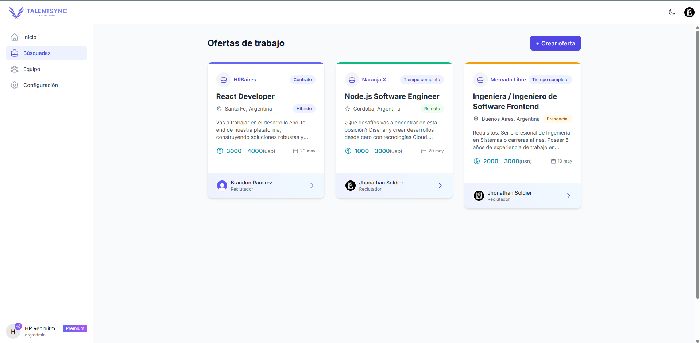
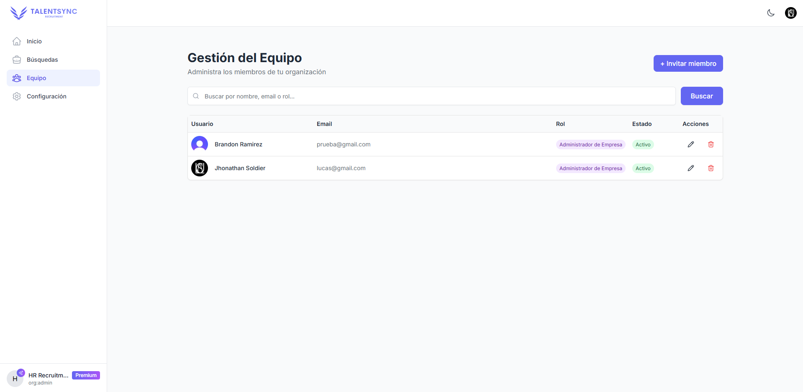

# 🧠 TalentSync — Plataforma de reclutamiento colaborativo con Clerk

> Plataforma que ayuda a equipos de reclutamiento a organizar búsquedas laborales, gestionar candidatos y colaborar internamente usando Clerk como núcleo de autenticación y control de acceso por organizaciones.

## 🚀 Demo

👉 [Ver demo en Vercel](https://talent-sync-ls.vercel.app/)

> Usuario demo: Podés loguearte con Google gracias a Clerk. Si estás en una organización, podés empezar a crear búsquedas directamente.

## 🧩 ¿Qué hace TalentSync?

- Administra búsquedas laborales creadas por reclutadores o administradores de empresa.
- Los usuarios se agrupan por organizaciones (gracias a Clerk), y cada búsqueda pertenece a una organización.
- Reclutadores pueden mover candidatos entre etapas, agregar preguntas personalizadas y más.
- Clerk maneja completamente la autenticación, roles y gestión de organizaciones.
- El sistema se adapta tanto a reclutamiento IT como general.

## 📸 Capturas

| Página principal de una búsqueda  | Vista de equipo                |
| --------------------------------- | ------------------------------ |
|  |  |

## 🛠️ ¿Cómo uso Clerk?

- **Autenticación con Clerk**: Cada usuario se autentica mediante Clerk. Utilizo `@clerk/nextjs` con App Router.
- **Organizaciones**: Uso las _organizations_ de Clerk para agrupar usuarios. Solo usuarios dentro de una misma organización pueden ver/crear búsquedas compartidas.
- **Roles**: Reconozco al administrador de la empresa (admin) y reclutadores mediante los roles dentro de la organización.
- **Metadata Personalizada**: Implementé un sistema de roles personalizados usando la metadata de Clerk para:
  - Definir permisos específicos por organización
  - Gestionar niveles de acceso personalizados
  - Controlar acciones específicas según el rol
  - Mantener la flexibilidad en la gestión de permisos
- **Protección de rutas**: Las rutas están protegidas por `auth()` y `currentUser()` de Clerk.
- **Acceso a `userId` y `organizationId`**: Uso `auth()` para extraer `userId` y `orgId` en el backend al momento de crear o leer búsquedas.
- **Sistema de Suscripciones**: Implementé un sistema de suscripciones que:
  - Verifica el estado de suscripción de cada organización
  - Limita el número de búsquedas según el plan
  - Gestiona la facturación y pagos
  - Proporciona acceso a características premium según el plan
  - Permite actualizar o cancelar suscripciones

## ⚙️ Tecnologías

- **Next.js (App Router)**
- **TypeScript**
- **Tailwind CSS**
- **Prisma ORM**
- **PostgreSQL**
- **Clerk (auth + organizations)**
- **Vercel**
- **Shadcn/ui**
- **Heroicons**

## 📂 Repositorio

Este es el repositorio público del proyecto:

🔗 [https://github.com/JCutisaca/TalentSync](https://github.com/JCutisaca/TalentSync)

## 📧 Contacto

Jhonathan Cutisaca - [@JCutisaca](https://github.com/JCutisaca)

Link del Proyecto: [https://github.com/JCutisaca/TalentSync](https://github.com/JCutisaca/TalentSync)
